# 🧠 Perfect Shuffle Fractals

**[Translated Article](https://github.com/xcontcom/perfect-shuffle/blob/main/docs/article.md) (Engilsh)**

[Original Article](https://habr.com/en/articles/340964/) (Russian language)

[Live demo](https://xcont.com/perfectshuffle/hybrid.html)

[Live demo 3D](https://xcont.com/perfectshuffle/fractal_3d_2.html)

These aren't your average fractals.

What you see here is the result of a brutally simple idea:
> Take a tiny grid, and recursively expand it using fixed spatial permutations.

No randomness.  
No equations.  
Just pure, symbolic structure — repeated through perfect, rule-based subdivision.

And the result?  
Fractals that look like logic itself folding in on itself.

---

### ⚙️ What's going on?

This system starts with a `2×2` binary grid. On each iteration:
- The grid doubles in size
- Each `2×2` block is filled based on the current rule set
- These rules are just **perfect shuffles** — deterministic rearrangements of pixel positions

You can think of each rule as a *spatial bitwise operation*.  
The result is a massive, recursively structured pattern, built from nothing but clean logic.

---

### 🔥 Why it's crazy cool

- **Perfect self-similarity** — no noise, no decay
- **Recursive logic** — every pixel is a decision made by a rule, not a formula
- **Unreasonably expressive** — despite the rules being tiny integers (`0–15`), the patterns explode into complexity
- **Visual proofs** — each image is a pure mathematical artifact

These aren't just visualizations. They're **symbolic systems unfolding**.  
They're the cousin of cellular automata and convolutional networks — but sharper, more discrete, and infinitely interpretable.

---

### 🧪 TL;DR

You are looking at:
- Recursive permutations
- Lossless symbolic expansion
- Fractal geometry with digital DNA

This is the cleanest chaos you’ll ever see.

---

### Gallery

| | | |
|---|---|---|
|2.1.15.14 grey|2.1.15.14 rgb|2.1.15.14 binary|
| 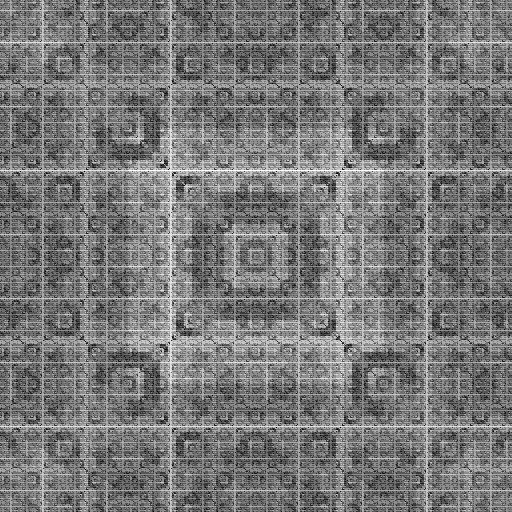 | 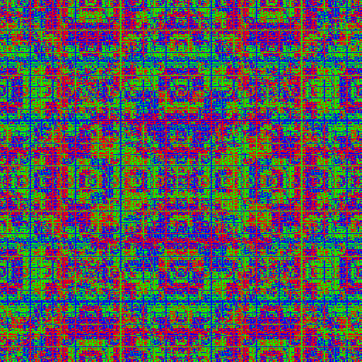 | 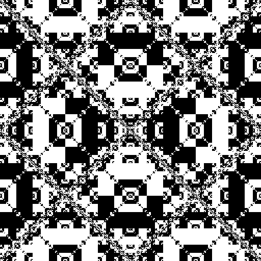 |
|6.14.0.0 grey|6.14.0.0 rgb|6.14.0.0 binary|
|  |  | 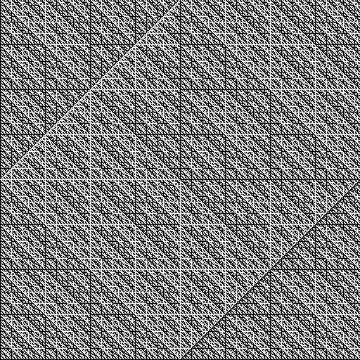 |
|9.4.0.11 grey|9.4.0.11 rgb|9.4.0.11 binary|
|  | 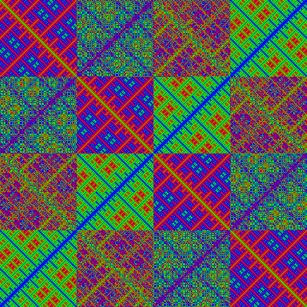 |  |
|4.8.4.7 grey|4.8.4.7 rgb|4.8.4.7 binary|
|  | 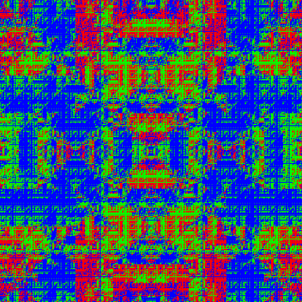 | 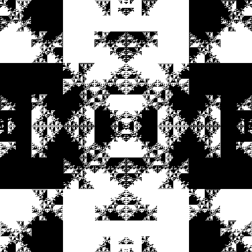 |
|13.14.0.3 grey|13.14.0.3 rgb|13.14.0.3 binary|
|  | 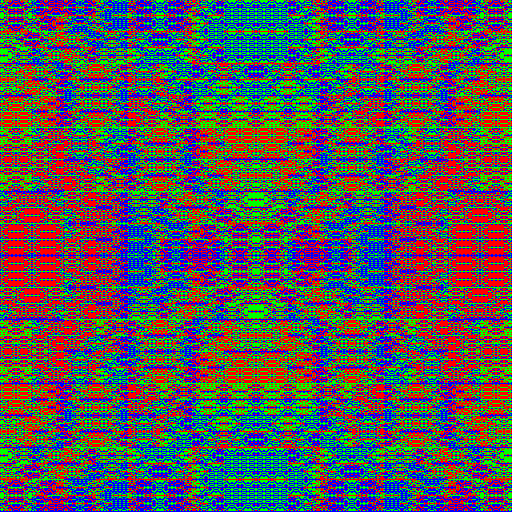 |  |
|14.1.11.10 grey|14.1.11.10 rgb|14.1.11.10 binary|
| 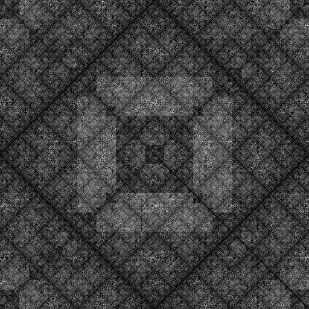 |  |  |
|4.13.15.0 grey|4.13.15.0 rgb|4.13.15.0 binary|
|  |  | 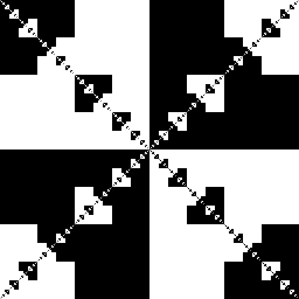 |
|15.6.8.3 grey|15.6.8.3 rgb|15.6.8.3 binary|
|  | 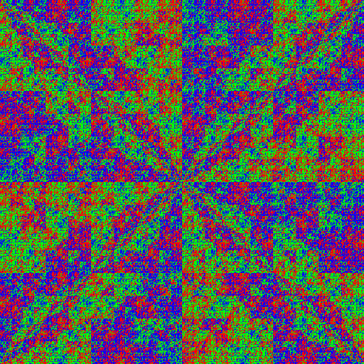 | 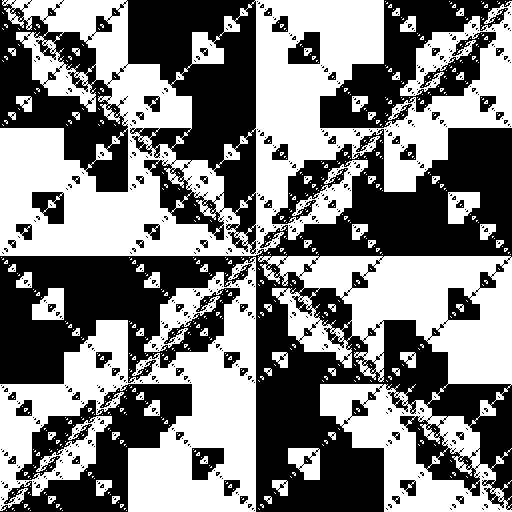 |
|4.0.2.14 grey|4.0.2.14 rgb|4.0.2.14 binary|
| 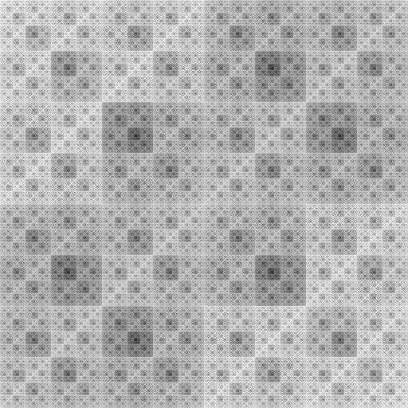 | 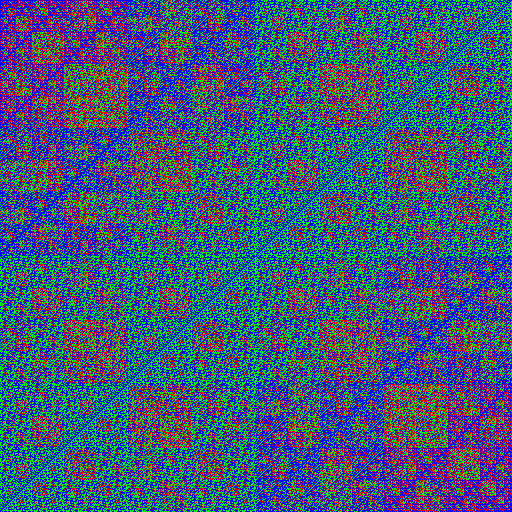 |  |
|5.0.2.15 grey|5.0.2.15 rgb|5.0.2.15 binary|
| 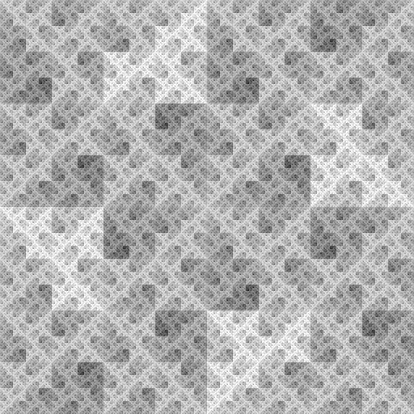 |  | 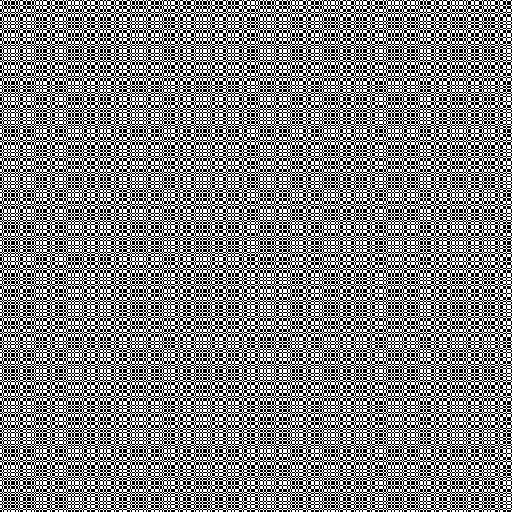 |
|2.0.2.9 grey|2.0.2.9 rgb|2.0.2.9 binary|
| 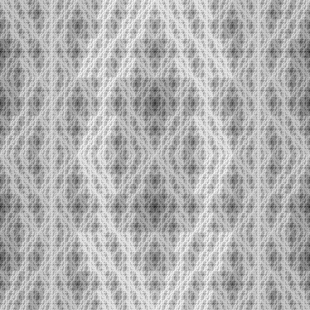 |  |  |
|14.3.1.0 grey|14.3.1.0 rgb|14.3.1.0 binary|
| 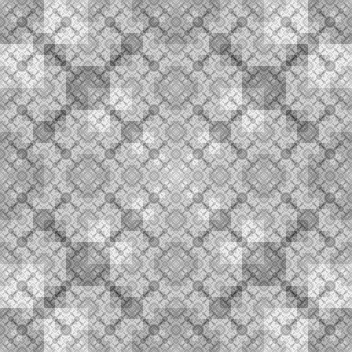 |  |  |
|4.1.11.8 grey|4.1.11.8 rgb|4.1.11.8 binary|
| 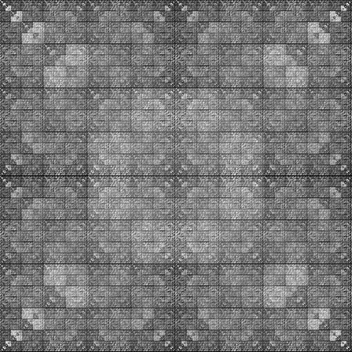 | 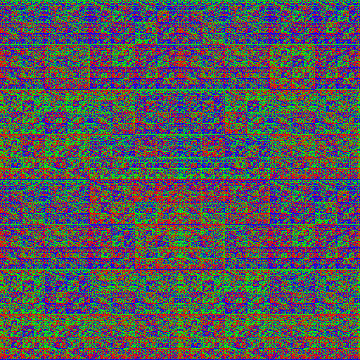 |  |
|10.0.3.0 grey|10.0.3.0 rgb|10.0.3.0 binary|
| 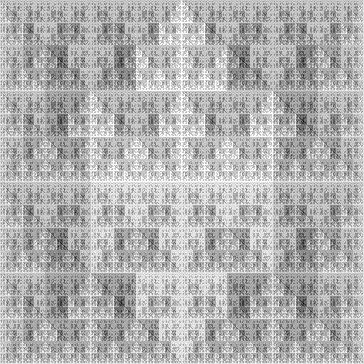 |  |  |

---

## 📄 License

MIT License. See [LICENSE](LICENSE) for details.

---

## 👤 Author

Serhii Herasymov  

sergeygerasimofff@gmail.com  

https://github.com/xcontcom
