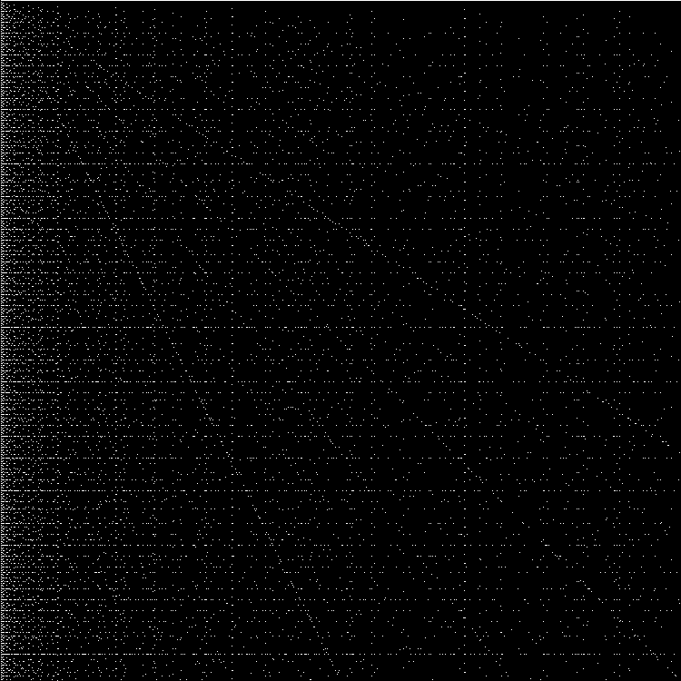
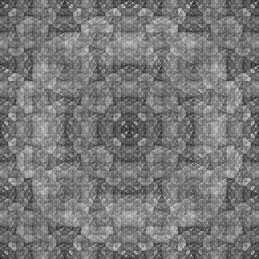
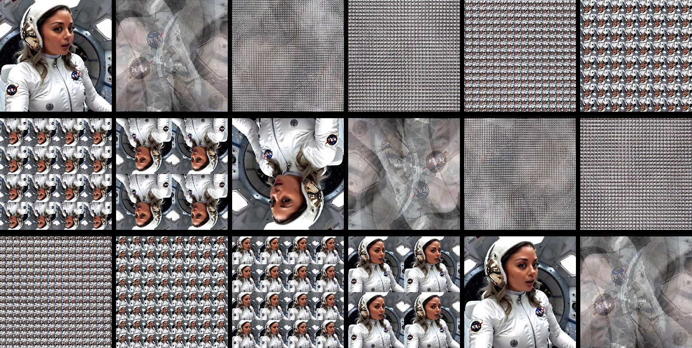

# The Perfect Shuffle

[Repository](https://github.com/xcontcom/perfect-shuffle)

This article is a translation and adaptation of my 2017 piece, originally published in Russian on Habr: [Perfect shuffle](https://habr.com/en/articles/340964/)


I have always been fascinated by elementary algorithms that create complex patterns. There is something fundamentally intriguing about such algorithms. One such algorithm is the Perfect Shuffle. Let's explore its unusual properties and create some striking fractals using this algorithm.

This article includes numerous images, GIF animations, and a bit of bullshit (12%).

The Perfect Shuffle, known among card magicians as the Faro Shuffle, captivated me when I began learning card tricks. Mastery starts with sleight of hand. After a week of practicing with a deck of cards, I became proficient in basic shuffling techniques: Riffle Shuffle, Faro Shuffle, and Charlier Pass. While practicing the Faro Shuffle, I arranged the deck with all black suits at the beginning and red suits at the end. After several shuffles, I noticed an intriguing order in the cards. I set the deck aside and turned to programming.

The Perfect Shuffle algorithm reorders elements in an array. It is remarkably simple:

1. Divide the array into two equal parts.
2. Place elements from the first half into even positions and elements from the second half into odd positions.

Visually:


Here’s a JavaScript implementation:

```javascript
function shuffle(array) {
    var half = array.length / 2;
    var temparray = [];
    for (var i = 0; i < half; i++) {
        temparray[i * 2] = array[i + half];
        temparray[i * 2 + 1] = array[i];
    }
    return temparray;
}

var array = [1, 2, 3, 4, 5, 6, 7, 8];
array = shuffle(array);
console.log(array); // [5, 1, 6, 2, 7, 3, 8, 4]
```

---

### A Brief Digression
Card enthusiasts call this version the "in-shuffle." There is also an "out-shuffle," where elements from the first half are placed in odd positions:


In the out-shuffle, outer elements remain in place, while the middle is shuffled like the in-shuffle. For simplicity, we will focus on the in-shuffle and assume arrays have an even number of elements, as odd-length arrays leave the last element static.

---

The Perfect Shuffle has fascinating properties. After a certain number of iterations, the array returns to its original order. This is because the algorithm is deterministic: each state has a unique predecessor, and the number of possible states is finite. The number of iterations required to restore the original order is less than or equal to the array length.

For example:
- An array of 12 elements requires 12 iterations:


- An array of 14 elements needs only 4 iterations:


The following image (clickable) shows arrays with lengths from 2 to 20 elements:


*(unshuffle)*

These arrays return to their original state after the following number of iterations:
2, 4, 3, 6, 10, 12, 4, 8, 18, 6
This sequence corresponds to [A002326](https://oeis.org/A002326).

```javascript
function a002326(n){
	var a=1;
	var m=0;
	do{
		a*=2;
		a%=2*n+1;
		m++;		
	}while(a>1);
	return m;
}
for(var n=1;n<11;n++){
	m=a002326(n);
	console.log(m);
}
```

Let’s visualize this with a graph. The X-axis represents the number of elements in the array (divided by 2), and the Y-axis shows the number of iterations. White dots mark the initial states (origin at the upper left):



The dots appear chaotically distributed.

Another intriguing property is that after a specific number of iterations, the array’s order may reverse. For a 12-element array, this occurs on the 6th iteration. Here’s a graph marking arrays that reverse:


The distribution remains chaotic.

Observing element movement is captivating. Consider filling the first half of the array with zeros and the second with ones (zeros as black pixels, ones as white). Each row (X) represents the array’s state, with iterations along the Y-axis.

For arrays with 142–150 elements:

     

For 288 elements (144*2):


For 610 elements:


### Exploring Other Array Lengths
A small [script](https://xcont.com/perfectshuffle/shuffle1d.html) ([shuffle1d.html](https://github.com/xcontcom/perfect-shuffle/blob/main/shuffle1d.html) in the repository) generates these patterns. Enter the array size (half the total length) and click "Draw."

The results remain chaotic. Let’s track a single element’s trajectory in a 610-element array, marking only the first element:


The position of an element after each iteration can be calculated without shuffling the entire array:

```
x[n+1] = {
    x[n]/2 + y/2, if x[n] % 2 == 0;
    (x[n] - 1)/2, if x[n] % 2 == 1;
}
```
(where `y` is the array length)

For arrays of lengths 2 to 22, the upper part of the image shows the array and the element’s position per iteration, while the lower part shows all possible positions:


The trajectory is unpredictable. Stacking these trajectories produces:

[](images/18.png)

*(Clickable)*

Black pixels indicate positions the first element never occupies during shuffling.

Let’s extend this to matrices. First, two array-based tricks:
1. Reverse the order of elements in the second half at each iteration:


2. Invert the elements in the second half:


These operations will be useful later.

Now, matrices. Fill a matrix with a diagonal pattern (first row: first element, second row: second element, etc.):


Shuffle the columns using Perfect Shuffle to track element movement. For an 80x80 matrix:


Adding another diagonal reveals a moiré pattern:


For a 242x242 matrix, iterations 27 to 35:


Now, shuffle both rows and columns. Here’s the modified function:

```javascript
function shufflecr(array) {
    var half = array.length / 2;
    var temparray = [];
    
    for (var x = 0; x < half; x++) {
        temparray[x * 2] = [];
        temparray[x * 2 + 1] = [];
        for (var y = 0; y < half; y++) {
            temparray[x * 2][y * 2] = array[x + half][y + half];
            temparray[x * 2 + 1][y * 2] = array[x][y + half];
            temparray[x * 2][y * 2 + 1] = array[x + half][y];
            temparray[x * 2 + 1][y * 2 + 1] = array[x][y];
        }
    }
    return temparray;
}
```

This function shuffles both rows and columns. Visually:


Shuffling diagonals is uneventful:


Shifting the diagonals one pixel right yields:


The function works, but the result is lackluster. Let’s try a random square in an 80x80 matrix (chosen because the order reverses on the 27th iteration):


Animate the square’s movement:


Now, draw a circle:


Notice the edge effects: the matrix behaves like a torus, especially visible on the second iteration:


---

### Trigonometric Connections
Consider the 288-element array pattern:


Write it into a matrix and shuffle:


Or, take the original pattern:


Keep pixels at coordinates `x*4+i`, `y*4+j` (for `i=2`, `j=2`):


Remove empty rows and columns:


For other `i` and `j`, this resembles a perfect unshuffle, dividing the matrix into 16 parts:


These patterns resemble those generated by trigonometric functions like `z = sin(n*x/y)` or `z = sin(n*x*y)`:

For `z = sin(3*x*y)` (white if `z >= 0`, black if `z < 0`):


For `z = sin(13*x*y)`:


---

Another pattern:


With a fill to highlight closed areas:


Reversing the order of elements produces striking patterns:


With a fill:


Inversion creates intriguing results. Start with an empty matrix, divide it into four parts, invert two, and shuffle:


The first iteration is unremarkable, but subsequent iterations reveal patterns:


To understand this, return to arrays. Instead of fixed lengths, grow the array iteratively:
1. Create an array of `n` elements.
2. Make a copy and invert it.
3. Shuffle the copy with the original to get an array of `n * 2` elements.
4. Repeat from step 2.

Starting with `[1, 0]`:
- `[1, 0]` (original)
- `[1, 0, 0, 1]` (array and inverted copy)
- `[0, 1, 1, 0]` (shuffled)
- `[0, 1, 1, 0, 1, 0, 0, 1]` (array and inverted copy)
- `[1, 0, 0, 1, 0, 1, 1, 0]`
- `[0, 1, 1, 0, 1, 0, 0, 1, 1, 0, 0, 1, 0, 1, 1, 0]`
- And so on.

This generates the Morse-Thue sequence ([A010060](https://oeis.org/A010060)), a simple fractal.

Back to matrices. Instead of shuffling four parts, copy the matrix, apply transformations, and shuffle with the copies. Possible transformations include:
- Action 0: Unchanged matrix
- Actions 1–7: Rotations
- Actions 8–15: Inversions

Visually:


Apply actions 0, 0, 7, 7 (action 7 rotates by 90°):


Next iteration:


Eighth iteration:


This produces a unique fractal.

---

### Alternative Fractal Method
Without Perfect Shuffle, apply actions 0, 0, 7, 7. First iteration:


Second iteration:


Eighth iteration:


Two additional tricks:
1. Overlay a copy with transparent white pixels, rotated 90°:


2. Rotate the copy vertically:


---

By combining these actions, we can generate 16^4 = 65,536 fractals. 

| | | |
|---|---|---|
|2.1.15.14 grey|2.1.15.14 rgb|2.1.15.14 binary|
|  |  |  |
|6.14.0.0 grey|6.14.0.0 rgb|6.14.0.0 binary|
|  |  |  |
|9.4.0.11 grey|9.4.0.11 rgb|9.4.0.11 binary|
|  |  |  |
|4.8.4.7 grey|4.8.4.7 rgb|4.8.4.7 binary|
|  |  |  |
|13.14.0.3 grey|13.14.0.3 rgb|13.14.0.3 binary|
|  |  |  |
|14.1.11.10 grey|14.1.11.10 rgb|14.1.11.10 binary|
|  |  |  |
|4.13.15.0 grey|4.13.15.0 rgb|4.13.15.0 binary|
|  |  |  |
|15.6.8.3 grey|15.6.8.3 rgb|15.6.8.3 binary|
|  |  |  |
|4.0.2.14 grey|4.0.2.14 rgb|4.0.2.14 binary|
|  |  |  |
|5.0.2.15 grey|5.0.2.15 rgb|5.0.2.15 binary|
|  |  |  |
|2.0.2.9 grey|2.0.2.9 rgb|2.0.2.9 binary|
|  |  |  |
|14.3.1.0 grey|14.3.1.0 rgb|14.3.1.0 binary|
|  |  |  |
|4.1.11.8 grey|4.1.11.8 rgb|4.1.11.8 binary|
|  |  |  |
|10.0.3.0 grey|10.0.3.0 rgb|10.0.3.0 binary|
|  |  |  |

Explore more with [script](https://xcont.com/perfectshuffle/hybrid.html) ([hybrid.html](https://github.com/xcontcom/perfect-shuffle/blob/main/hybrid.html) in the repository).

Here are the "card tricks" we got. I think we can stop here for now (you can shuffle three-dimensional matrices, but that's another time), (if any of the grasshoppers want to look at shuffling three-dimensional matrices - [script](https://xcont.com/perfectshuffle/fractal_3d_2.html) ([fractal_3d_2.html](https://github.com/xcontcom/perfect-shuffle/blob/main/fractal_3d_2.html) in the repository)).

### Melody Generation
I experimented with a [melody generator using a genetic algorithm](https://github.com/xcontcom/perfect-shuffle-music). Each melody consists of note genes. Random shuffling produces cacophony, but Perfect Shuffle creates intriguing melodies.

---

### Final Note




```
"No cats were shuffled in the making of this fractal. Any resemblance to space chicks is purely coincidental."
```

## About the Author
Serhii Herasymov  
*Programmer & Math Enthusiast* (Ukraine → Ireland)  

Email: sergeygerasimofff@gmail.com  
GitHub: [xcontcom](https://github.com/xcontcom)  
X (Twitter): [@xcontcom](https://x.com/xcontcom)  

Feedback welcome.
